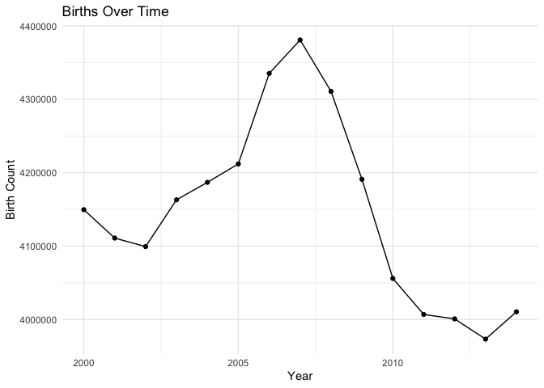
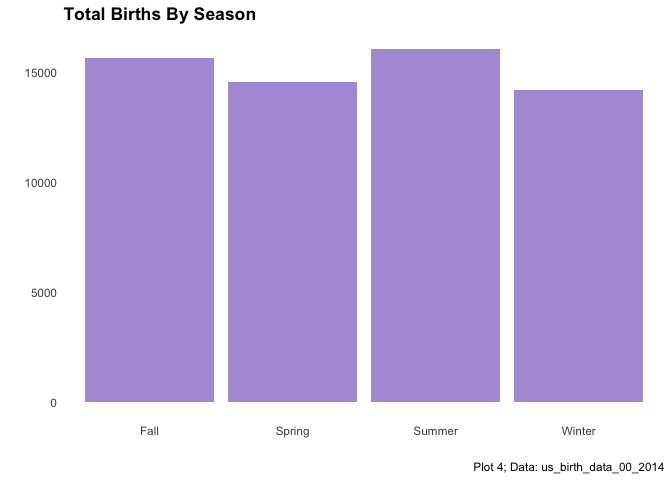
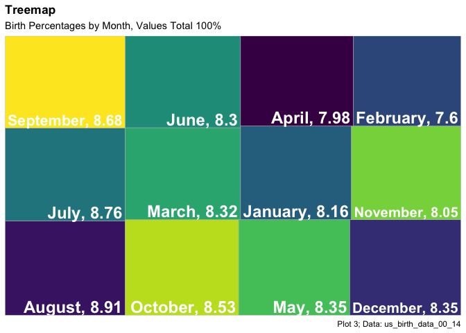

# Data Visualization Project 01

## U.S. Birth Data from 2000-2014
This project will review birth data in the United States from 2000-2014. Variables given from this dataset include: `year`, `month`, `date_of_month`, the full date `date`, `day_of_week`, and `birth` count. These variables assist in creating the following data visualizations.


## Variable Addition
Created here is the additional variable, `season`. 


```r
birth_data <- read_csv("https://raw.githubusercontent.com/reisanar/datasets/master/us_births_00_14.csv")
```

```
## Parsed with column specification:
## cols(
##   year = col_double(),
##   month = col_double(),
##   date_of_month = col_double(),
##   date = col_date(format = ""),
##   day_of_week = col_character(),
##   births = col_double()
## )
```

```r
#Create a new column identifying the season of births
birth_data <- birth_data %>%
  mutate(
    season = case_when(
      month %in% 10:12 ~ "Fall",
      month %in%  1:3  ~ "Winter",
      month %in%  4:6  ~ "Spring",
      TRUE ~ "Summer"))
summary(birth_data)
```

```
##       year          month        date_of_month        date           
##  Min.   :2000   Min.   : 1.000   Min.   : 1.00   Min.   :2000-01-01  
##  1st Qu.:2003   1st Qu.: 4.000   1st Qu.: 8.00   1st Qu.:2003-10-01  
##  Median :2007   Median : 7.000   Median :16.00   Median :2007-07-02  
##  Mean   :2007   Mean   : 6.523   Mean   :15.73   Mean   :2007-07-02  
##  3rd Qu.:2011   3rd Qu.:10.000   3rd Qu.:23.00   3rd Qu.:2011-04-01  
##  Max.   :2014   Max.   :12.000   Max.   :31.00   Max.   :2014-12-31  
##  day_of_week            births         season         
##  Length:5479        Min.   : 5728   Length:5479       
##  Class :character   1st Qu.: 8740   Class :character  
##  Mode  :character   Median :12343   Mode  :character  
##                     Mean   :11350                     
##                     3rd Qu.:13082                     
##                     Max.   :16081
```
## Total Births

The following visualization was edited from its original format from recommendations, shows all recorded births over the 15 year time-span - originally the graph was not fluid and showed several breaks throughout the years.


```r
tot_births <- birth_data %>%
  group_by(year) %>%
  summarise(total=sum(births), .groups = "drop") %>% 
  ggplot(aes(x = year, y = total)) + 
  geom_point() + 
  geom_line() +
  labs(title = "Births Over Time",
       x = "Year",
       y = "Birth Count") +
    theme( panel.grid.major = element_blank(), plot.title = element_text(face="bold"))
tot_births + theme_minimal()
```

<!-- -->


## Births by Season

The following is a bar chart from the created `season` variable. This was interesting because we can see that winter has the fewest births overall.


```r
ggplot(birth_data, aes(x=season, y=births)) +
  geom_bar(stat="identity", position = position_dodge(), fill="#b19cd9") +
  labs(title = "Total Births By Season",
       x = "",
       y = "",
       caption = "Plot 4; Data: us_birth_data_00_2014") +
   theme_minimal() +
  theme(panel.grid.major = element_blank(), panel.grid.minor = element_blank(), legend.title = element_blank(), plot.title = element_text(face="bold"))
```

<!-- -->
       

```r
# find percentage of births by month
birth_data$date <- as.Date(birth_data$date, format="%Y~%m%d")
birth_data$month <- format(birth_data$date, format="%B")

monthly_pct <- birth_data %>%
  group_by(month) %>%
  summarize(total = sum(births)) %>%
  mutate(prop = round(100* total / sum(total),2))
```

```
## `summarise()` ungrouping output (override with `.groups` argument)
```

```r
monthly_pct
```

```
## # A tibble: 12 x 3
##    month       total  prop
##    <chr>       <dbl> <dbl>
##  1 April     4960750  7.98
##  2 August    5540170  8.91
##  3 December  5194432  8.35
##  4 February  4725693  7.6 
##  5 January   5072588  8.16
##  6 July      5450418  8.76
##  7 June      5163360  8.3 
##  8 March     5172961  8.32
##  9 May       5195445  8.35
## 10 November  5008750  8.05
## 11 October   5302865  8.53
## 12 September 5399592  8.68
```
## Treemap

Above we have created the overall monthly percentages of birth over the 15 years of data - from here we can visualize with a Treemap. The following Treemap is not as extravagant as others I have seen - but it still offers insight. From recommendations, a comma and space was created between the Month title and percentages.
       

```r
tm1 <- ggplot(monthly_pct, aes(area = total, fill = month, label = paste(month, prop, sep = ", "))) +
  geom_treemap(show.legend = FALSE) +
  geom_treemap_text(fontface = "bold", colour="white", place="bottomright", grow = FALSE) + 
  scale_fill_viridis_d() +
  labs(title = "Treemap",
       subtitle = "Birth Percentages by Month, Values Total 100%",
       caption = "Plot 3; Data: us_birth_data_00_14") +
  theme( plot.title = element_text(face="bold"))
tm1
```

<!-- -->
