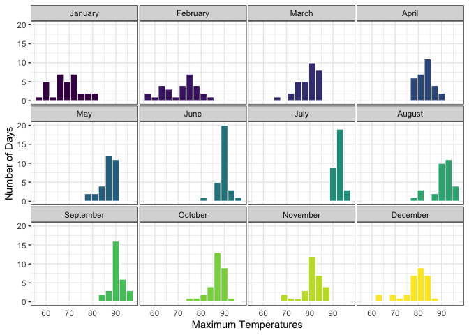
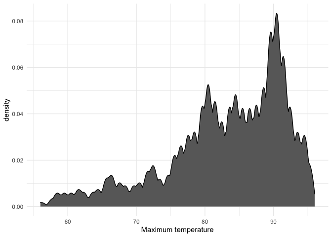
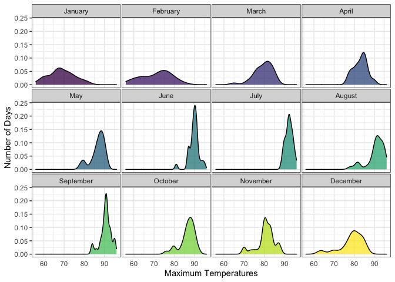
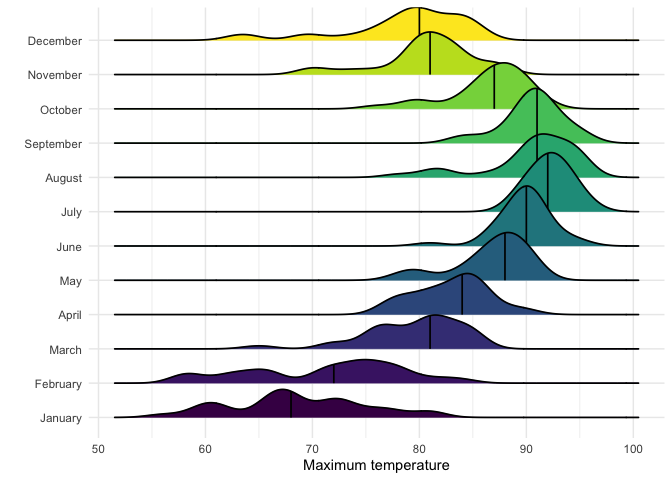
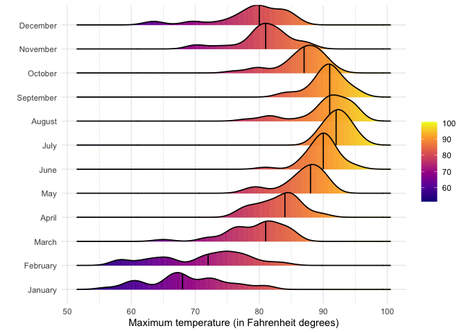
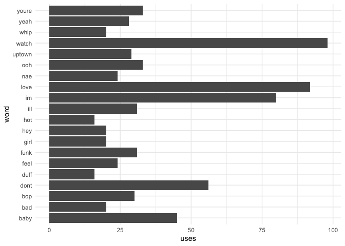
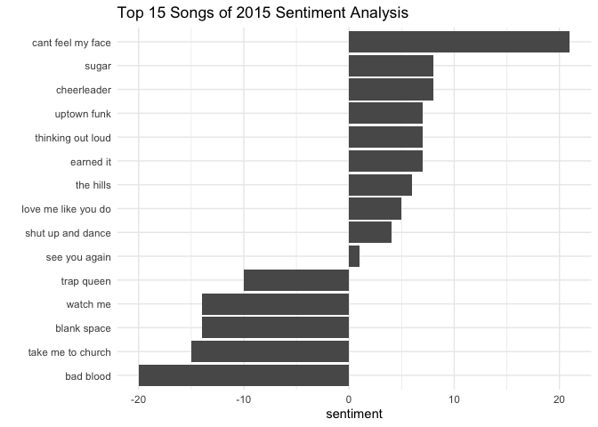

# Data Visualization Project 03


In this exercise you will explore methods to visualize text data and practice how to recreate charts that show the distributions of a continuous variable. 


## Part 1: Density Plots

Using the dataset obtained from FSU's [Florida Climate Center](https://climatecenter.fsu.edu/climate-data-access-tools/downloadable-data), for a station at Tampa International Airport (TPA) from 2016 to 2017, attempt to recreate the charts shown below


```r
library(tidyverse)
weather_tpa <- read_csv("https://github.com/reisanar/datasets/raw/master/tpa_weather_16_17.csv")
# random sample 
sample_n(weather_tpa, 4)
```

```
## # A tibble: 4 x 6
##    year month   day precipitation max_temp min_temp
##   <dbl> <dbl> <dbl>         <dbl>    <dbl>    <dbl>
## 1  2016    12     3          0          80       58
## 2  2016     2     5          0          64       45
## 3  2016    11     5          0          84       66
## 4  2016     1    16          0.03       75       60
```


```r
library(ggplot2)
library(lubridate)
```

```
## 
## Attaching package: 'lubridate'
```

```
## The following objects are masked from 'package:base':
## 
##     date, intersect, setdiff, union
```

```r
library(dplyr)
library(ggridges)
library(tidyverse)
library(hrbrthemes)
```

```
## NOTE: Either Arial Narrow or Roboto Condensed fonts are required to use these themes.
```

```
##       Please use hrbrthemes::import_roboto_condensed() to install Roboto Condensed and
```

```
##       if Arial Narrow is not on your system, please see https://bit.ly/arialnarrow
```

```r
tpa_clean <- weather_tpa %>% 
  unite("doy", year, month, day, sep = "-") %>% 
  mutate(doy = ymd(doy), 
         max_temp = as.double(max_temp), 
         min_temp = as.double(min_temp), 
         precipitation = as.double(precipitation))

tpa_clean$doy <- as.Date(tpa_clean$doy, format="%Y~%m%d")
tpa_clean$month <- format(tpa_clean$doy, format="%B")
tpa_clean$month <- factor(tpa_clean$month, 
                         levels = c("January", "February", "March", "April", "May", "June", "July", "August", "September", "October", "November", "December"))
```

(a) Recreate the plot below:


Hint: the option `binwidth = 3` was used with the `geom_histogram()` function.


```r
a <- ggplot(tpa_clean, aes(x = max_temp, fill = month)) +
  geom_histogram(binwidth = 3, color = "white") +
  theme_bw() +
  theme(legend.position="none",
      panel.spacing = unit(0.1, "lines"),
      axis.ticks.x=element_blank()) + 
  scale_fill_viridis_d() +
  facet_wrap(~month)
a +   labs(x = "Maximum Temperatures",
       y = "Number of Days")
```

<!-- -->


(b) Recreate the plot below:


Hint: check the `kernel` parameter of the `geom_density()` function, and use `bw = 0.5`.


```r
tpa_clean %>%
  ggplot() +
    geom_density( aes(x=max_temp), fill="#696969", bw =0.5, alpha=1.0, kernel="epanechnikov") +
  labs(x = "Maximum temperature") +
    theme_minimal()
```

<!-- -->

(c) Recreate the chart below:


Hint: default options for `geom_density()` were used. 


```r
c <-ggplot(tpa_clean, aes(x=max_temp, fill=month)) +
    geom_density(alpha=0.75) +
  theme_bw() +
    facet_wrap(~month) +
  scale_fill_viridis_d() +
    theme(
      legend.position="none",
      panel.spacing = unit(0.1, "lines"),
      axis.ticks.x=element_blank()
    )
c +   labs(x = "Maximum Temperatures",
       y = "Number of Days")
```

<!-- -->

(d) Recreate the chart below:


Hint: default options for `geom_density()` were used. 


```r
d <- ggplot(tpa_clean,
  aes(x = `max_temp`,
      y = month,
      fill = month)) +
  geom_density_ridges_gradient(scale = 1.75, size = 0.6, quantile_lines = TRUE,
                               quantiles = 0.5) +
  scale_fill_viridis_d() +
  labs(x = "Maximum temperature",
       y = "") +
  guides(fill=FALSE)
d + theme_minimal()
```

```
## Picking joint bandwidth of 1.49
```

<!-- -->


(e) Recreate the plot below:


Hint: use the`ggridges` package, and the `geom_density_ridges()` function paying close attention to the `quantile_lines` and `quantiles` parameters.


```r
e <- ggplot(tpa_clean,
  aes(x = `max_temp`,
      y = month,
      fill = month)) +
  geom_density_ridges_gradient(scale = 1.75, size = 0.6, quantile_lines = TRUE,
                               quantiles = 0.5) +
  scale_fill_viridis_d() +
  labs(x = "Maximum temperature",
       y = "") +
  guides(fill=FALSE)
e + theme_minimal()
```

```
## Picking joint bandwidth of 1.49
```

<!-- -->

(f) Recreate the chart below:


Hint: this uses the `plasma` option (color scale) for the _viridis_ palette.


```r
f <-ggplot(tpa_clean,
  aes(x = `max_temp`,
      y = month,
      fill = stat(x))) +
  geom_density_ridges_gradient(scale = 1.75, size = 0.6, quantile_lines = TRUE, quantiles = 0.5) +
  scale_fill_viridis_c(option = "C") +
  labs(x = "Maximum temperature (in Fahrenheit degrees)",
       y = "",
       fill = "")
f + theme_minimal()
```

```
## Picking joint bandwidth of 1.49
```

<!-- -->


## Part 2: Visualizing Text Data

Review the set of slides (and additional resources linked in it) for visualizing text data: https://www.reisanar.com/slides/text-viz#1

Choose any dataset with text data, and create at least one visualization with it. For example, you can create a frequency count of most used bigrams, a sentiment analysis of the text data, a network visualization of terms commonly used together, and/or a visualization of a topic modeling approach to the problem of identifying words/documents associated to different topics in the text data you decide to use. 

Make sure to include a copy of the dataset in the `data/` folder, and reference your sources if different from the ones listed below:

- [Billboard Top 100 Lyrics](https://github.com/reisanar/datasets/blob/master/BB_top100_2015.csv)

- [RateMyProfessors comments](https://github.com/reisanar/datasets/blob/master/rmp_wit_comments.csv)

- [FL Poly News 2020](https://github.com/reisanar/datasets/blob/master/poly_news_FL20.csv)

- [FL Poly News 2019](https://github.com/reisanar/datasets/blob/master/poly_news_FL19.csv)

(to get the "raw" data from any of the links listed above, simply click on the `raw` button of the GitHub page and copy the URL to be able to read it in your computer using the `read_csv()` function)


```r
library(tidytext)
top_100 <- read_csv("https://raw.githubusercontent.com/reisanar/datasets/master/BB_top100_2015.csv")
```

```
## Parsed with column specification:
## cols(
##   Rank = col_double(),
##   Song = col_character(),
##   Artist = col_character(),
##   Year = col_double(),
##   Lyrics = col_character(),
##   Source = col_double()
## )
```

```r
top_100 %>%
  top_n(10) %>%
  filter(Rank %in% 1:10) %>%
  unnest_tokens(word, Lyrics, token = "words") %>%
  filter(!word %in% stop_words$word, str_detect(word, "[a-z]"))
```

```
## Selecting by Source
```

```
## # A tibble: 1,777 x 6
##     Rank Song        Artist                            Year Source word    
##    <dbl> <chr>       <chr>                            <dbl>  <dbl> <chr>   
##  1     1 uptown funk mark ronson featuring bruno mars  2015      1 hit     
##  2     1 uptown funk mark ronson featuring bruno mars  2015      1 ice     
##  3     1 uptown funk mark ronson featuring bruno mars  2015      1 cold    
##  4     1 uptown funk mark ronson featuring bruno mars  2015      1 michelle
##  5     1 uptown funk mark ronson featuring bruno mars  2015      1 pfeiffer
##  6     1 uptown funk mark ronson featuring bruno mars  2015      1 white   
##  7     1 uptown funk mark ronson featuring bruno mars  2015      1 gold    
##  8     1 uptown funk mark ronson featuring bruno mars  2015      1 hood    
##  9     1 uptown funk mark ronson featuring bruno mars  2015      1 girls   
## 10     1 uptown funk mark ronson featuring bruno mars  2015      1 girls   
## # … with 1,767 more rows
```


```r
ten_top <- top_100 %>%
  filter(Rank %in% 1:15) %>%
  unnest_tokens(word, Lyrics, token = "words") %>%
  filter(!word %in% stop_words$word, str_detect(word, "[a-z]"))

ten_top %>%
  group_by(word) %>%
  summarise(uses=n()) %>%
  arrange(desc(uses = n()))
```

```
## `summarise()` ungrouping output (override with `.groups` argument)
```

```
## # A tibble: 757 x 2
##    word       uses
##    <chr>     <int>
##  1 70s           1
##  2 aah           2
##  3 abel          1
##  4 absolutes     1
##  5 accent        1
##  6 accused       1
##  7 acoustic      1
##  8 affection     1
##  9 afraid        1
## 10 againaah      2
## # … with 747 more rows
```

```r
head(10)
```

```
## [1] 10
```


```r
wordviz <- ten_top %>%
  group_by(word) %>%
  summarise(uses=n()) %>%
  arrange(desc(uses)) %>%
  slice(1:20) %>%
  ggplot() +
  geom_bar(aes(x=word, y=uses),
           stat = "identity") +
  coord_flip() +
  theme_minimal()
```

```
## `summarise()` ungrouping output (override with `.groups` argument)
```

```r
wordviz
```

<!-- -->


```r
sent_a <- ten_top %>%
  inner_join(get_sentiments("bing")) %>%
  count(Song, sentiment) %>%
  spread(sentiment, n, fill = 0) %>%
  mutate(sentiment = positive - negative) %>%
  ggplot() + 
  geom_bar(aes(x = reorder(Song, sentiment), 
               y = sentiment), 
           stat = "identity") + 
  coord_flip() + 
  labs(x = "", 
       title = "Top 15 Songs of 2015 Sentiment Analysis") + 
  theme_minimal()
```

```
## Joining, by = "word"
```

```r
sent_a
```

<!-- -->
